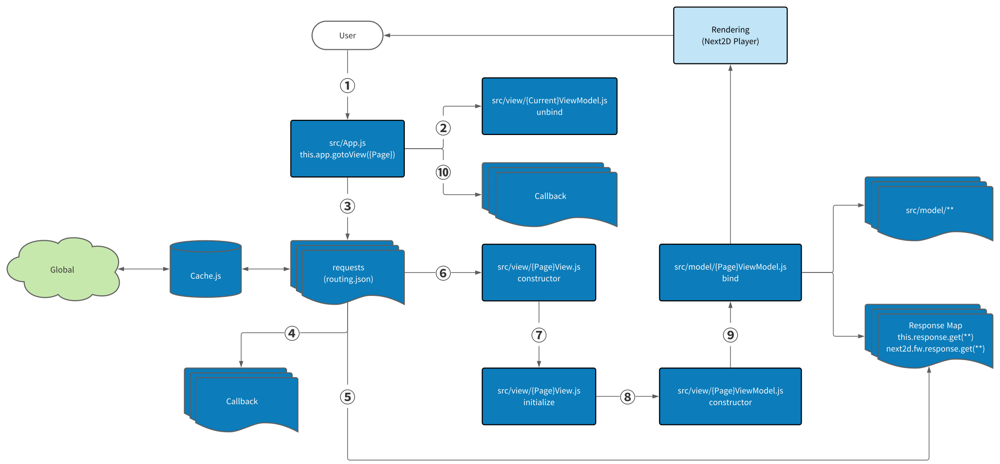

Next2D Framework
=============


[](https://github.com/Next2D/Framework/actions/workflows/integration.yml)
[](https://github.com/Next2D/Framework/actions/workflows/codeql-analysis.yml)
[](https://github.com/Next2D/Framework/actions/workflows/lint.yml) \
[](https://github.com/Next2D/Framework/releases)
[](https://github.com/Next2D/Framework/blob/main/LICENSE)
[](https://next2d.app/docs/player/index.html)
[](https://discord.gg/6c9rv5Uns5)
[](https://twitter.com/intent/user?screen_name=Next2D)


Next2D Framework for the Model-View-ViewModel(MVVM) pattern.

## Quick Start

Create Next2D apps with no build configuration.
```sh
npx create-next2d-app app-name
cd app-name
npm start
```

## Directory Configuration

```sh
project
├── src
│   ├── index.js
│   ├── App.js
│   ├── Packages.js // It will be generated automatically.
│   │
│   ├── config
│   │   ├── config.json  // Configuration files for each environment.
│   │   ├── routing.json // Request settings before loading the view.
│   │   ├── stage.json   // Display(Stage) area setting. 
│   │   └── Config.js    // It will be generated automatically.
│   │
│   ├── content // Symbolic access to JSON created with NoCode Tool
│   │   ├── top
│   │   │   └── TopContent.js
│   │   └── home
│   │       └── HomeContent.js
│   │
│   ├── image
│   │   └── default empty
│   │
│   ├── model // business logic
│   │   ├── callbask
│   │   │   └── default empty
│   │   └── default empty
│   │
│   └── view // Per-page View, ViewModel files.
│       ├── top
│       │   ├── TopView.js
│       │   └── TopViewModel.js
│       └── home
│           ├── HomeView.js
│           └── HomeViewModel.js
│
└── __tests__ // Unit Test directory
    └── model
        └── default empty
```

## Chart Flow


## Commands

* Starts the development server.
```sh
npm start
```

* Generate the necessary View and ViewModel classes from the routing JSON file.
```sh
npm run generate
```

* Bundles the app into static files for production.
```sh
npm run build -- --env="prd"
```

* Starts the test runner.
```sh
npm test
```

## Configuration JSON

### stage.json

| name | value | default | description |
| --- | --- | --- | --- |
| `width` | number | 240 | This is the setting for the width of the display area. |
| `height` | number | 240 | This is the setting for the height of the display area. |
| `fps` | number | 12 | The number of times to draw per second. |

#### Option settings

| name | value | default | description |
| --- | --- | --- | --- |
| `base` | string | . |  The value to be set if the URL is not set at the time of the request. |
| `fullScreen` | boolean | true |  It will be drawn beyond the width and height set in the fullscreen setting and stage. |
| `tagId` | string | empty | Set value of the ID of the DOM where you want to set the drawing. |
| `bgColor` | array [R,G,B,A] or false | false | RGBA can be specified from 0-255. |

### config.json

You can set a common value for each environment.\
The values below all are available for all environments.

| name | value | default | description |
| --- | --- | --- | --- |
| `spa` | boolean | true | As a Single Page Application, the scene can be controlled by URL. |
| `loading` | boolean | true | Setting whether or not to display the loading screen until the preparation for screen transition is complete. |
| `gotoView`.`callback` | string or array | null | You can specify the class to call back after the `gotoView` function finishes. |

### routing.json

Properties that can be set in the `requests` property.

| name | value | default | description |
| --- | --- | --- | --- |
| `path` | {{endPoint}}path/to/api | empty | Get the value of the string enclosed in {{***}} from config.json. |
| `type` | `json` or `content` or `image` | json | The value is fixed as described. |
| `name` | string | empty | When the name is set, the data retrieved with the name as the key will be set in the Response Map. |
| `cache` | boolean | false | Caches the retrieved data using the value set in name as a key. |
| `callback` | string or array | null | You can specify the class to call back after the request is completed. The value will be set to the first argument of the contractor of the specified class and will be taken over. |

## License
This project is licensed under the [MIT License](https://opensource.org/licenses/MIT) - see the [LICENSE](LICENSE) file for details.