Next2D Framework
=============
<div align="center">
  
</div>

[](https://github.com/Next2D/Framework/actions/workflows/integration.yml)
[](https://github.com/Next2D/framework/actions/workflows/github-code-scanning/codeql)
[](https://github.com/Next2D/Framework/actions/workflows/lint.yml)

[](https://github.com/Next2D/Framework/releases)
[](https://github.com/Next2D/Framework/releases)
[](https://discord.gg/6c9rv5Uns5)
[](https://twitter.com/Next2D)

[日本語]  
Next2D Frameworkは、クリーンアーキテクチャー、ドメイン駆動開発、テスト駆動開発、MVVMの原則に従って設計されおり、柔軟性、拡張性、保守性に重点を置いたアーキテクチャーとデザイン手法で各レイヤーを疎結合に保つ事が可能です。  
  
従来のCanvasアプリケーションでは困難だったURLによるシーン管理（SPA）を可能にし、シーン毎のUI開発・画面確認が可能になりました。UI構築にはアトミックデザインを推奨しており、コンポーネントの細分化、再利用可能なモジュール設計など、効率的なUI構築と保守が可能となっています。  
  
また、テスト駆動開発を重視しているため、ユニットテスト、統合テスト、UIテストなど、さまざまなレベルでテストを行いながら、高品質なコードの開発をサポートします。  
  
[English]  
The Next2D Framework is designed according to principles of clean architecture, domain-driven development, test-driven development, and MVVM. Its architecture and design methodology prioritize flexibility, scalability, and maintainability, enabling loose coupling between layers.  
  
It enables scene management via URLs (SPA), which was difficult with traditional Canvas applications, allowing UI development and screen verification per scene. We recommend Atomic Design for UI construction, enabling efficient UI development and maintenance through component granularity and reusable module design.  
  
Furthermore, with a strong emphasis on test-driven development, it supports the creation of high-quality code by facilitating testing at various levels, including unit tests, integration tests, and UI tests.

[简体中文]  
Next2D框架是根据简洁架构、领域驱动开发、测试驱动开发和MVVM的原则设计的，其架构和设计方法注重灵活性、可扩展性和可维护性，使每一层都能保持松散耦合。  
  
它可以通过URL（SPA）实现场景管理，这在传统的Canvas应用程序中是很难实现的，并且可以为每个场景进行UI开发和屏幕检查。 该系统能够实现高效的UI构建和维护。  
  
此外，对测试驱动开发的强调支持高质量代码的开发，同时在各个层面进行测试，包括单元测试、集成测试和UI测试。  

## Architecture

```
src/
├── application/            # Application Layer
│   ├── Application.ts      # Main application class
│   ├── Context.ts          # View/ViewModel context management
│   ├── content/            # Content classes (MovieClip, Shape, TextField, Video)
│   ├── service/            # Application services (pure functions)
│   │   ├── QueryStringParserService.ts
│   │   └── RoutingRequestsParserService.ts
│   ├── usecase/            # Application use cases (with side effects)
│   │   ├── ApplicationGotoViewUseCase.ts
│   │   ├── ApplicationInitializeUseCase.ts
│   │   ├── ContextRunUseCase.ts
│   │   └── ExecuteCallbackUseCase.ts
│   └── variable/           # Application state (Config, Context, Cache, Packages, Query)
├── domain/                 # Domain Layer
│   ├── entity/             # Domain entities
│   │   └── DefaultLoader.ts
│   ├── service/            # Domain services
│   │   ├── LoadingService.ts
│   │   ├── ScreenOverlayService.ts
│   │   └── ViewBinderService.ts
│   └── variable/           # Domain state
├── infrastructure/         # Infrastructure Layer
│   ├── dto/                # Data Transfer Objects
│   │   └── ResponseDTO.ts
│   ├── repository/         # External data access
│   │   ├── ContentRepository.ts
│   │   ├── CustomRepository.ts
│   │   └── JsonRepository.ts
│   ├── service/            # Infrastructure services
│   │   ├── RequestCacheCheckService.ts
│   │   └── RequestResponseProcessService.ts
│   ├── usecase/            # Infrastructure use cases
│   │   ├── RequestUseCase.ts
│   │   └── ResponseRemoveVariableUseCase.ts
│   └── variable/           # Infrastructure state
├── interface/              # TypeScript interfaces
│   ├── IConfig.ts          # Configuration interface
│   ├── IRequest.ts         # Request interface
│   ├── IRouting.ts         # Routing interface
│   └── ...
├── shared/                 # Shared utilities
│   └── util/               # Pure utility functions
│       ├── NormalizeHttpMethod.ts
│       ├── ParseQueryString.ts
│       └── ToCamelCase.ts
└── view/                   # View Layer
    ├── View.ts             # Base View class (abstract)
    └── ViewModel.ts        # Base ViewModel class (abstract)
```

## Support

[日本語]  
最新ニュースや技術情報は、Twitterの[@Next2D](https://twitter.com/Next2D)や公式の[Website](https://next2d.app/ja/)で発信していきますので、チェックしてみてください。  
Next2Dがお役に立つようでしたら、プロジェクトをご支援いただければ幸いです。  
  
[English]  
Please check [@Next2D](https://twitter.com/Next2D) on Twitter and the [official website](https://next2d.app/en/) for the latest news and technical information.    
If Next2D is useful to you, we hope you will support our project.  
  
[简体中文]  
请在Twitter上查看[@Next2D](https://twitter.com/Next2D)和[官方网站](https://next2d.app/cn/)，了解最新的新闻和技术信息。  
如果Next2D对你有用，我们希望你能支持我们的项目。  
  
<div align="center">
  <a href="https://github.com/sponsors/Next2D" target="_blank">
    
  </a>
</div>

## Quick Start - JavaScript Development Environment

```sh
npx create-next2d-app sample-app --template @next2d/framework-template
cd app-name
npm start
```

## Quick Start - TypeScript Development Environment

```sh
npx create-next2d-app sample-app --template @next2d/framework-typescript-template
cd app-name
npm start
```

## API Reference

### Application

| Method | Description |
|--------|-------------|
| `gotoView(name?)` | Navigate to a View. If no argument, parses URL |
| `getContext()` | Get the current Context |
| `getResponse()` | Get the response data Map |
| `getCache()` | Get the cache data Map |

### View Lifecycle

| Method | Description |
|--------|-------------|
| `initialize()` | Called after constructor |
| `onEnter()` | Called when View is displayed |
| `onExit()` | Called when View is hidden |

### ViewModel Lifecycle

| Method | Description |
|--------|-------------|
| `initialize()` | Called after constructor |

### Context

| Property/Method | Description |
|-----------------|-------------|
| `view` | Current View instance |
| `viewModel` | Current ViewModel instance |
| `root` | Root Sprite on Stage |

### Exported Classes

```typescript
import {
    app,              // Application instance
    View,             // Base View class
    ViewModel,        // Base ViewModel class
    MovieClipContent, // MovieClip content from Animation Tool
    ShapeContent,     // Shape content from Animation Tool
    TextFieldContent, // TextField content from Animation Tool
    VideoContent      // Video content from Animation Tool
} from "@next2d/framework";
```

## Configuration

### IConfig

```typescript
interface IConfig {
    platform: string;        // "web" | "app"
    spa: boolean;            // Enable SPA mode
    defaultTop?: string;     // Default top page name (default: "top")
    stage: {
        width: number;       // Stage width
        height: number;      // Stage height
        fps: number;         // Frame rate
        options?: {
            base?: string;
            fullScreen?: boolean;
            tagId?: string;
            bgColor?: string;
        };
    };
    loading?: {
        callback: string;    // Loading class name
    };
    gotoView?: {
        callback: string | string[];  // Callback after view transition
    };
    routing?: {
        [key: string]: {
            private?: boolean;
            redirect?: string;
            requests?: IRequest[];
        };
    };
}
```

### IRequest

```typescript
interface IRequest {
    type: "json" | "content" | "custom" | "cluster";
    path?: string;           // URL path
    name?: string;           // Response key name
    cache?: boolean;         // Enable caching
    callback?: string | string[];
    // For custom type
    class?: string;
    access?: "static" | "instance";
    method?: string;
    // For HTTP requests
    headers?: HeadersInit;
    body?: any;
}
```

## Flowchart

```mermaid
graph TD
    User([User]) -->|Request| GotoView[gotoView Path]
    
    GotoView --> LoadingCheck{use loading?<br/>Default: true}
    
    LoadingCheck -->|YES| ScreenOverlay[Screen Overlay]
    LoadingCheck -->|NO| RemoveResponse
    ScreenOverlay --> LoadingStart[Start Loading]
    LoadingStart --> RemoveResponse
    
    RemoveResponse[Remove Previous Response Data] --> ParseQuery[Parse Query String]
    ParseQuery --> UpdateHistory{SPA mode?}
    
    UpdateHistory -->|YES| PushState[Push History State]
    UpdateHistory -->|NO| RequestType
    PushState --> RequestType
    
    RequestType[Request Type]
    
    RequestType --> JSON[JSON: Get external JSON data]
    RequestType --> CONTENT[CONTENT: Get Animation Tool JSON]
    RequestType --> CUSTOM[CUSTOM: Request to external API]
    
    JSON --> CacheCheck{use cache?<br/>Default: false}
    CONTENT --> CacheCheck
    CUSTOM --> CacheCheck
    
    CacheCheck -->|YES| CacheData[(Cache)]
    CacheCheck -->|NO| GlobalData{{Global Network}}
    
    CacheData --> Cached{Cached?}
    
    Cached -->|NO| GlobalData
    Cached -->|YES| RegisterResponse
    GlobalData --> RegisterResponse
    
    RegisterResponse[Register Response Data] --> RequestCallback{request callback?}
    
    RequestCallback -->|YES| ExecRequestCallback[Execute Request Callback]
    RequestCallback -->|NO| UnbindView
    ExecRequestCallback --> UnbindView
    
    UnbindView[Previous View: onExit & Unbind] --> BindView[New View/ViewModel: Bind]
    BindView --> ViewModelInit[ViewModel: initialize]
    
    ViewModelInit --> ViewInit[View: initialize]
    ViewInit --> AddToStage[Add View to Stage]
    AddToStage --> GotoViewCallback{gotoView callback?}
    
    GotoViewCallback -->|YES| ExecGotoViewCallback[Execute gotoView Callback]
    GotoViewCallback -->|NO| LoadingEndCheck
    ExecGotoViewCallback --> LoadingEndCheck
    
    LoadingEndCheck{use loading?<br/>Default: true}
    
    LoadingEndCheck -->|YES| LoadingEnd[End Loading]
    LoadingEndCheck -->|NO| OnEnter
    LoadingEnd --> DisposeOverlay[Dispose Screen Overlay]
    DisposeOverlay --> OnEnter
    
    OnEnter[View: onEnter] --> StartDrawing
    
    StartDrawing[Start Drawing] -->|Response| User
    
    style User fill:#d5e8d4,stroke:#82b366
    style StartDrawing fill:#dae8fc,stroke:#6c8ebf
    style CacheData fill:#fff2cc,stroke:#d6b656
    style GlobalData fill:#f5f5f5,stroke:#666666
```



## License
This project is licensed under the [MIT License](https://opensource.org/licenses/MIT) - see the [LICENSE](LICENSE) file for details.
