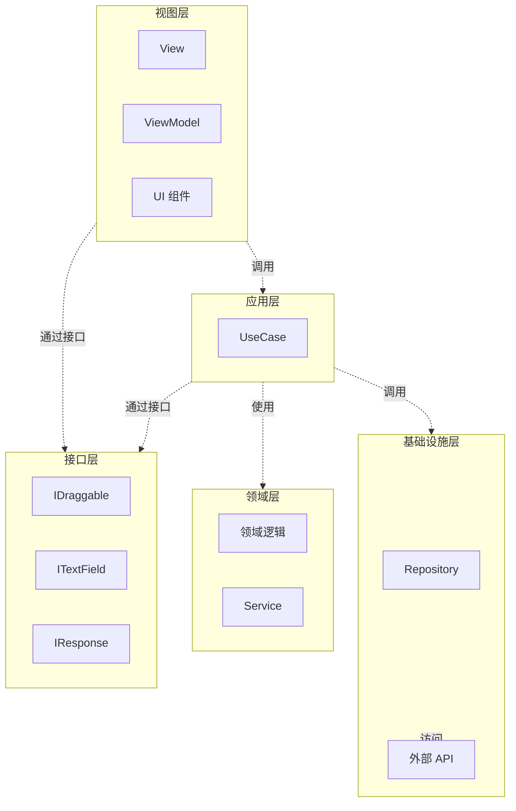
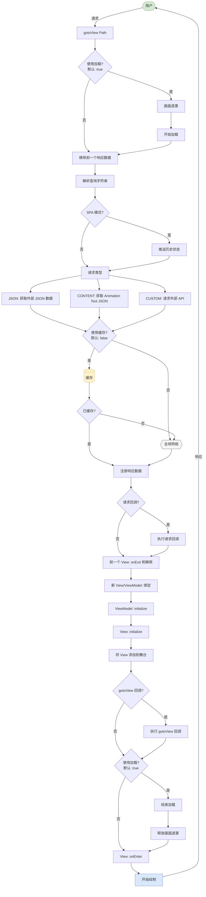

# Next2D Framework

Next2D Framework 是一个用于构建 Next2D Player 应用程序的 MVVM 框架。它提供单页应用程序（SPA）的路由、View/ViewModel 管理和配置管理。

## 主要特性

- **MVVM 模式**：通过 Model-View-ViewModel 分离关注点
- **Clean Architecture**：依赖倒置和松耦合设计
- **单页应用程序**：基于 URL 的场景管理
- **Animation Tool 集成**：与 Animation Tool 资源无缝集成
- **TypeScript 支持**：类型安全的开发
- **原子设计**：推荐的可重用组件设计

## 架构概述

本项目实现了 Clean Architecture 和 MVVM 模式的组合。



### 层职责

| 层 | 路径 | 角色 |
|---|------|------|
| **View** | `view/*`, `ui/*` | 处理画面结构和显示 |
| **ViewModel** | `view/*` | View 和 Model 之间的桥梁，事件处理 |
| **Interface** | `interface/*` | 抽象层，类型定义 |
| **Application** | `model/application/*/usecase/*` | 业务逻辑实现（UseCase） |
| **Domain** | `model/domain/*` | 核心业务规则 |
| **Infrastructure** | `model/infrastructure/repository/*` | 数据访问，外部 API 集成 |

### 依赖方向

遵循 Clean Architecture 原则，依赖始终指向内部（领域层）。

- **视图层**：通过接口使用应用层
- **应用层**：通过接口使用领域层和基础设施层
- **领域层**：不依赖任何东西（纯业务逻辑）
- **基础设施层**：实现领域层接口

## 目录结构

```
my-app/
├── src/
│   ├── config/                    # 配置文件
│   │   ├── stage.json             # 舞台设置
│   │   ├── config.json            # 环境设置
│   │   ├── routing.json           # 路由设置
│   │   └── Config.ts              # 配置类型定义和导出
│   │
│   ├── interface/                 # 接口定义
│   │   ├── IDraggable.ts          # 可拖动对象
│   │   ├── ITextField.ts          # 文本字段
│   │   ├── IHomeTextResponse.ts   # API 响应类型
│   │   └── IViewName.ts           # 视图名称类型定义
│   │
│   ├── view/                      # View 和 ViewModel
│   │   ├── top/
│   │   │   ├── TopView.ts         # 画面结构定义
│   │   │   └── TopViewModel.ts    # 业务逻辑桥梁
│   │   └── home/
│   │       ├── HomeView.ts
│   │       └── HomeViewModel.ts
│   │
│   ├── model/
│   │   ├── application/           # 应用层
│   │   │   ├── top/
│   │   │   │   └── usecase/
│   │   │   │       └── NavigateToViewUseCase.ts
│   │   │   └── home/
│   │   │       └── usecase/
│   │   │           ├── StartDragUseCase.ts
│   │   │           ├── StopDragUseCase.ts
│   │   │           └── CenterTextFieldUseCase.ts
│   │   │
│   │   ├── domain/                # 领域层
│   │   │   └── callback/
│   │   │       ├── Background.ts
│   │   │       └── Background/
│   │   │           └── service/
│   │   │               ├── BackgroundDrawService.ts
│   │   │               └── BackgroundChangeScaleService.ts
│   │   │
│   │   └── infrastructure/        # 基础设施层
│   │       └── repository/
│   │           └── HomeTextRepository.ts
│   │
│   ├── ui/                        # UI 组件
│   │   ├── animation/             # 动画定义
│   │   │   └── top/
│   │   │       └── TopBtnShowAnimation.ts
│   │   │
│   │   ├── component/             # 原子设计
│   │   │   ├── atom/              # 最小单元组件
│   │   │   │   ├── ButtonAtom.ts
│   │   │   │   └── TextAtom.ts
│   │   │   ├── molecule/          # 组合的 Atom 组件
│   │   │   │   ├── HomeBtnMolecule.ts
│   │   │   │   └── TopBtnMolecule.ts
│   │   │   ├── organism/          # 多个 Molecule 组合
│   │   │   ├── template/          # 页面模板
│   │   │   └── page/              # 页面组件
│   │   │       ├── top/
│   │   │       │   └── TopPage.ts
│   │   │       └── home/
│   │   │           └── HomePage.ts
│   │   │
│   │   └── content/               # Animation Tool 生成的内容
│   │       ├── TopContent.ts
│   │       └── HomeContent.ts
│   │
│   ├── assets/                    # 静态资源
│   │
│   ├── Packages.ts                # 包导出
│   └── index.ts                   # 入口点
│
├── file/                          # Animation Tool 输出文件
│   └── sample.n2d
│
├── mock/                          # 模拟数据
│   ├── api/                       # API 模拟
│   ├── content/                   # 内容模拟
│   └── img/                       # 图像模拟
│
└── package.json
```

## 框架流程图

使用 gotoView 函数的画面转换详细流程。



### 关键流程步骤

| 步骤 | 说明 |
|------|------|
| **gotoView** | 画面转换的入口点 |
| **Loading** | 加载画面显示/隐藏控制 |
| **Request Type** | 三种请求类型：JSON、CONTENT、CUSTOM |
| **Cache** | 响应数据缓存控制 |
| **View/ViewModel Bind** | 新 View/ViewModel 的绑定过程 |
| **onEnter** | 画面显示完成后的回调 |

## 关键设计模式

### 1. MVVM（Model-View-ViewModel）

- **View**：处理画面结构和显示。没有业务逻辑
- **ViewModel**：View 和 Model 之间的桥梁。持有 UseCase 并处理事件
- **Model**：处理业务逻辑和数据访问

### 2. UseCase 模式

为每个用户操作创建专用的 UseCase 类：

```typescript
export class StartDragUseCase
{
    execute(target: IDraggable): void
    {
        target.startDrag();
    }
}
```

### 3. 依赖倒置

依赖接口，而不是具体类：

```typescript
// 好：依赖接口
import type { IDraggable } from "@/interface/IDraggable";

function startDrag(target: IDraggable): void
{
    target.startDrag();
}
```

### 4. Repository 模式

抽象数据访问并实现错误处理：

```typescript
export class HomeTextRepository
{
    static async get(): Promise<IHomeTextResponse>
    {
        try {
            const response = await fetch(`${config.api.endPoint}api/home.json`);
            if (!response.ok) {
                throw new Error(`HTTP error! status: ${response.status}`);
            }
            return await response.json();
        } catch (error) {
            console.error("Failed to fetch:", error);
            throw error;
        }
    }
}
```

## 快速开始

### 创建项目

```bash
npx create-next2d-app my-app
cd my-app
npm install
npm start
```

### 自动生成 View/ViewModel

```bash
npm run generate
```

此命令解析 `routing.json` 中的顶级属性并生成相应的 View 和 ViewModel 类。

## 最佳实践

1. **接口优先**：始终依赖接口，而不是具体类型
2. **单一职责原则**：每个类只有一个职责
3. **依赖注入**：通过构造函数注入依赖
4. **错误处理**：在 Repository 层适当处理错误
5. **类型安全**：避免 `any` 类型，使用显式类型定义

## 相关文档

### 基础
- [View/ViewModel](/cn/reference/framework/view) - 画面显示和数据绑定
- [路由](/cn/reference/framework/routing) - 基于 URL 的画面转换
- [配置](/cn/reference/framework/config) - 环境和舞台设置
- [Animation Tool 集成](/cn/reference/framework/animation-tool) - 使用 Animation Tool 资源

### Next2D Player 集成
- [Next2D Player](/cn/reference/player) - 渲染引擎
- [MovieClip](/cn/reference/player/movie-clip) - 时间轴动画
- [事件系统](/cn/reference/player/events) - 用户交互
