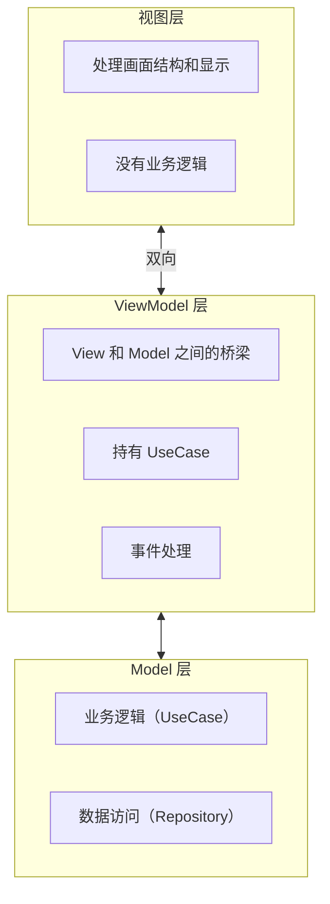
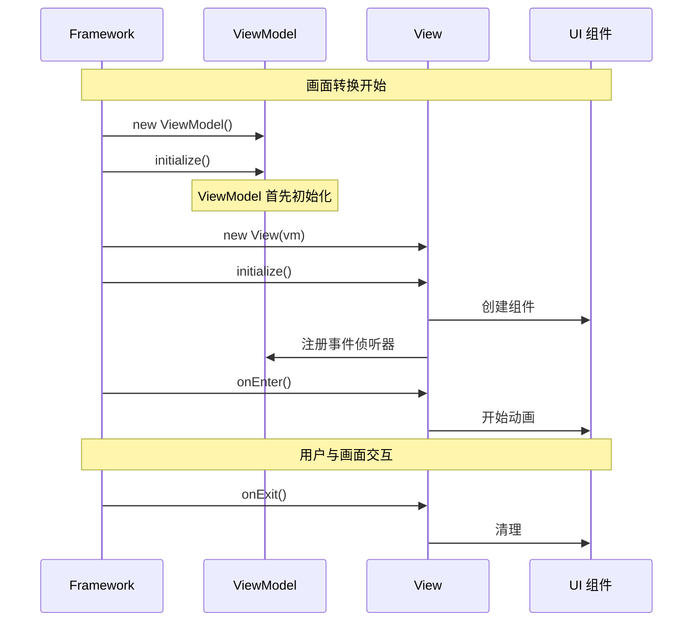

# View 和 ViewModel

Next2D Framework 采用 MVVM（Model-View-ViewModel）模式。基本风格是每个画面创建一组 View 和 ViewModel。

## 架构



## 目录结构

```
src/
└── view/
    ├── top/
    │   ├── TopView.ts
    │   └── TopViewModel.ts
    └── home/
        ├── HomeView.ts
        └── HomeViewModel.ts
```

## View

View 是附加到主上下文的容器。View 只处理显示结构，将业务逻辑委托给 ViewModel。

### View 职责

- **画面结构定义** - UI 组件放置和坐标设置
- **事件侦听器注册** - 与 ViewModel 方法的连接
- **生命周期管理** - `initialize`、`onEnter`、`onExit`

### 基本结构

```typescript
import type { TopViewModel } from "./TopViewModel";
import { View } from "@next2d/framework";
import { TopPage } from "@/ui/component/page/top/TopPage";

export class TopView extends View<TopViewModel>
{
    private readonly _topPage: TopPage;

    constructor(vm: TopViewModel)
    {
        super(vm);
        this._topPage = new TopPage();
        this.addChild(this._topPage);
    }

    async initialize(): Promise<void>
    {
        this._topPage.initialize(this.vm);
    }

    async onEnter(): Promise<void>
    {
        await this._topPage.onEnter();
    }

    async onExit(): Promise<void>
    {
        return void 0;
    }
}
```

### 生命周期



#### initialize() - 初始化

**何时调用：**
- View 实例创建后立即
- 画面转换期间只调用一次
- 在 ViewModel 的 `initialize()` **之后**执行

**主要用途：**
- 创建和排列 UI 组件
- 注册事件侦听器
- 添加子元素（`addChild`）

```typescript
async initialize(): Promise<void>
{
    const { HomeBtnMolecule } = await import("@/ui/component/molecule/HomeBtnMolecule");
    const { PointerEvent } = next2d.events;

    const homeContent = new HomeBtnMolecule();
    homeContent.x = 120;
    homeContent.y = 120;

    // 将事件委托给 ViewModel
    homeContent.addEventListener(
        PointerEvent.POINTER_DOWN,
        this.vm.homeContentPointerDownEvent
    );

    this.addChild(homeContent);
}
```

#### onEnter() - 画面显示时

**何时调用：**
- `initialize()` 完成后
- 画面显示前

**主要用途：**
- 开始入场动画
- 启动计时器和间隔
- 设置焦点

```typescript
async onEnter(): Promise<void>
{
    const topBtn = this.getChildByName("topBtn") as TopBtnMolecule;
    topBtn.playEntrance(() => {
        console.log("动画完成");
    });
}
```

#### onExit() - 画面隐藏时

**何时调用：**
- 转换到另一个画面前
- View 销毁前

**主要用途：**
- 停止动画
- 清除计时器和间隔
- 释放资源

```typescript
async onExit(): Promise<void>
{
    if (this.autoSlideTimer) {
        clearInterval(this.autoSlideTimer);
        this.autoSlideTimer = null;
    }
}
```

## ViewModel

ViewModel 充当 View 和 Model 之间的桥梁。它持有 UseCase 并处理来自 View 的事件以执行业务逻辑。

### ViewModel 职责

- **事件处理** - 从 View 接收事件
- **UseCase 执行** - 调用业务逻辑
- **依赖管理** - 持有 UseCase 实例
- **状态管理** - 管理画面特定状态

### 基本结构

```typescript
import { ViewModel, app } from "@next2d/framework";
import { NavigateToViewUseCase } from "@/model/application/top/usecase/NavigateToViewUseCase";

export class TopViewModel extends ViewModel
{
    private readonly navigateToViewUseCase: NavigateToViewUseCase;
    private topText: string = "";

    constructor()
    {
        super();
        this.navigateToViewUseCase = new NavigateToViewUseCase();
    }

    async initialize(): Promise<void>
    {
        // 从 routing.json 的 requests 接收数据
        const response = app.getResponse();
        this.topText = response.has("TopText")
            ? (response.get("TopText") as { word: string }).word
            : "";
    }

    getTopText(): string
    {
        return this.topText;
    }

    async onClickStartButton(): Promise<void>
    {
        await this.navigateToViewUseCase.execute("home");
    }
}
```

### ViewModel 初始化时机

**重要：ViewModel 的 `initialize()` 在 View 的 `initialize()` 之前调用。**

```
1. ViewModel 实例创建
   ↓
2. ViewModel.initialize() ← ViewModel 先
   ↓
3. View 实例创建（ViewModel 注入）
   ↓
4. View.initialize()
   ↓
5. View.onEnter()
```

这确保了 View 初始化时 ViewModel 数据已准备就绪。

```typescript
// HomeViewModel.ts
export class HomeViewModel extends ViewModel
{
    private homeText: string = "";

    async initialize(): Promise<void>
    {
        // 在 ViewModel 的 initialize 中获取数据
        const data = await HomeTextRepository.get();
        this.homeText = data.word;
    }

    getHomeText(): string
    {
        return this.homeText;
    }
}

// HomeView.ts
export class HomeView extends View<HomeViewModel>
{
    constructor(private readonly vm: HomeViewModel)
    {
        super();
    }

    async initialize(): Promise<void>
    {
        // 此时，vm.initialize() 已经完成
        const text = this.vm.getHomeText();

        // 使用获取的数据构建 UI
        const textField = new TextAtom(text);
        this.addChild(textField);
    }
}
```

## 画面转换

使用 `app.gotoView(name?: string)` 进行画面转换。返回值是 `Promise<void>`，可用于等待完整的转换流程（请求执行、View/ViewModel 重新绑定、`onEnter()` 调用）。

`gotoView` 要点：

- `name` 参数类型是 `string`（可省略，默认值为 `""`）。
- `name` 传入 `routing.json` 的键（如 `home`、`quest/list`），也支持 `?id=123` 这类查询字符串。
- 省略 `name` 时，会从当前 URL 解析目标路由（常用于 SPA 的 `popstate` 流程）。
- 转换开始时会先清空上一画面的 `response`，然后将新请求结果按 `name` 键重新写入。
- 当 `config.json` 中设置 `all.spa: true` 时，普通转换会通过 `pushState` 更新浏览器历史。

```typescript
import { app } from "@next2d/framework";

// 导航到指定的 View
await app.gotoView("home");

// 带参数导航
await app.gotoView("user/detail?id=123");
```

### UseCase 中的画面转换

```typescript
import { app } from "@next2d/framework";

export class NavigateToViewUseCase
{
    async execute(viewName: string): Promise<void>
    {
        await app.gotoView(viewName);
    }
}
```

## 获取上下文

`app.getContext()` 返回当前运行时的 `Context`，包含：

- `root`：Stage 下的根 `Sprite`
- `view`：当前绑定的 View（转换中或启动初期可能为 `null`）
- `viewModel`：当前绑定的 ViewModel（转换中或启动初期可能为 `null`）

```typescript
import { app } from "@next2d/framework";

const context = app.getContext();
const root = context.root;

if (context.view && context.viewModel) {
    // 访问当前 View / ViewModel
}
```

## 获取响应数据

`app.getResponse()` 返回 `Map<string, unknown>`。`routing.json` 的 `requests` 中设置了 `name` 的响应，会按当前一次画面转换写入该 Map。

`getResponse` 要点：

- 它是单次 `gotoView` 的临时数据容器。
- 开始下一次 `gotoView` 时，上一轮内容会被清空。
- 值类型为 `unknown`，业务侧应使用类型守卫或类型断言后再读取。

```typescript
import { app } from "@next2d/framework";

async initialize(): Promise<void>
{
    const response = app.getResponse();

    if (response.has("UserData")) {
        const userData = response.get("UserData");
        this.userName = userData.name;
    }
}
```

## 获取缓存数据

`app.getCache()` 返回 `Map<string, unknown>`。在 `requests` 中设置 `cache: true` 的数据会跨画面保留，适合主数据等可复用数据。

`getCache` 要点：

- 同时具备 `cache: true` 和 `name` 的请求会进入缓存。
- 当相同键已存在时，请求处理可优先复用缓存值。
- 缓存不会自动清理；不再需要时请显式 `delete` 或 `clear`。

```typescript
import { app } from "@next2d/framework";

const cache = app.getCache();
if (cache.has("MasterData")) {
    const masterData = cache.get("MasterData");
}
```

## 设计原则

### 1. 关注点分离

```typescript
// 好：View 只处理显示，ViewModel 处理逻辑
class HomeView extends View<HomeViewModel>
{
    async initialize(): Promise<void>
    {
        const btn = new HomeBtnMolecule();
        btn.addEventListener(PointerEvent.POINTER_DOWN, this.vm.onClick);
    }
}

class HomeViewModel extends ViewModel
{
    onClick(event: PointerEvent): void
    {
        this.someUseCase.execute();
    }
}
```

### 2. 依赖倒置

ViewModel 依赖接口，而不是具体类。

```typescript
// 好：依赖接口
homeContentPointerDownEvent(event: PointerEvent): void
{
    const target = event.currentTarget as unknown as IDraggable;
    this.startDragUseCase.execute(target);
}
```

### 3. 始终将事件委托给 ViewModel

永远不要在 View 内部完全处理事件；始终委托给 ViewModel。

## View/ViewModel 模板

### View

```typescript
import type { YourViewModel } from "./YourViewModel";
import { View } from "@next2d/framework";

export class YourView extends View<YourViewModel>
{
    constructor(vm: YourViewModel)
    {
        super(vm);
    }

    async initialize(): Promise<void>
    {
        // 创建和排列 UI 组件
    }

    async onEnter(): Promise<void>
    {
        // 画面显示时
    }

    async onExit(): Promise<void>
    {
        // 画面隐藏时
    }
}
```

### ViewModel

```typescript
import { ViewModel } from "@next2d/framework";
import { YourUseCase } from "@/model/application/your/usecase/YourUseCase";

export class YourViewModel extends ViewModel
{
    private readonly yourUseCase: YourUseCase;

    constructor()
    {
        super();
        this.yourUseCase = new YourUseCase();
    }

    async initialize(): Promise<void>
    {
        return void 0;
    }

    yourEventHandler(event: Event): void
    {
        this.yourUseCase.execute();
    }
}
```

## 相关

- [路由](/cn/reference/framework/routing)
- [配置](/cn/reference/framework/config)
