# Next2D Framework

Next2D Framework is an MVVM framework for building applications with Next2D Player. It provides routing for single-page applications (SPA), View/ViewModel management, and configuration management.

## Key Features

- **MVVM Pattern**: Separation of concerns with Model-View-ViewModel
- **Single Page Application**: URL-based scene management
- **Open Animation Tool Integration**: Seamless integration with Open Animation Tool assets
- **TypeScript Support**: Type-safe development

## Quick Start

### Create Project

```bash
npx create-next2d-app my-app
cd my-app
npm install
npm run dev
```

### Directory Structure

```
my-app/
├── src/
│   ├── config/
│   │   └── config.json       # Configuration
│   ├── view/
│   │   └── TopView.ts        # View class
│   └── index.ts              # Entry point
├── asset/
│   └── content.json          # Open Animation Tool output
└── package.json
```

## Core Concepts

### View

Views are responsible for screen display and correspond to MovieClips created with Open Animation Tool.

```typescript
import { View } from "@next2d/framework";

export class TopView extends View
{
    constructor()
    {
        super();
    }

    async $setup(): Promise<void>
    {
        // Initial setup
    }

    $ready(): void
    {
        // Ready for display
    }

    $dispose(): void
    {
        // Cleanup
    }
}
```

### ViewModel

ViewModel handles business logic for the View.

```typescript
import { ViewModel } from "@next2d/framework";

export class TopViewModel extends ViewModel
{
    async $setup(): Promise<void>
    {
        // Initialize data
    }

    $bind(): void
    {
        // Bind to View
    }
}
```

### Routing

Configure routing in config.json:

```json
{
  "routing": {
    "top": {
      "path": "/",
      "view": "TopView"
    },
    "about": {
      "path": "/about",
      "view": "AboutView"
    },
    "detail": {
      "path": "/detail/{id}",
      "view": "DetailView"
    }
  }
}
```

## Framework Flowchart

Detailed flow of screen transitions using the gotoView function.

```mermaid
graph TD
    User([User]) -->|Request| GotoView[gotoView Path]

    GotoView --> LoadingCheck{use loading?<br/>Default: true}

    LoadingCheck -->|YES| ScreenOverlay[Screen Overlay]
    LoadingCheck -->|NO| RemoveResponse
    ScreenOverlay --> LoadingStart[Start Loading]
    LoadingStart --> RemoveResponse

    RemoveResponse[Remove Previous Response Data] --> ParseQuery[Parse Query String]
    ParseQuery --> UpdateHistory{SPA mode?}

    UpdateHistory -->|YES| PushState[Push History State]
    UpdateHistory -->|NO| RequestType
    PushState --> RequestType

    RequestType[Request Type]

    RequestType --> JSON[JSON: Get external JSON data]
    RequestType --> CONTENT[CONTENT: Get Animation Tool JSON]
    RequestType --> CUSTOM[CUSTOM: Request to external API]

    JSON --> CacheCheck{use cache?<br/>Default: false}
    CONTENT --> CacheCheck
    CUSTOM --> CacheCheck

    CacheCheck -->|YES| CacheData[(Cache)]
    CacheCheck -->|NO| GlobalData{{Global Network}}

    CacheData --> Cached{Cached?}

    Cached -->|NO| GlobalData
    Cached -->|YES| RegisterResponse
    GlobalData --> RegisterResponse

    RegisterResponse[Register Response Data] --> RequestCallback{request callback?}

    RequestCallback -->|YES| ExecRequestCallback[Execute Request Callback]
    RequestCallback -->|NO| UnbindView
    ExecRequestCallback --> UnbindView

    UnbindView[Previous View: onExit & Unbind] --> BindView[New View/ViewModel: Bind]
    BindView --> ViewModelInit[ViewModel: initialize]

    ViewModelInit --> ViewInit[View: initialize]
    ViewInit --> AddToStage[Add View to Stage]
    AddToStage --> GotoViewCallback{gotoView callback?}

    GotoViewCallback -->|YES| ExecGotoViewCallback[Execute gotoView Callback]
    GotoViewCallback -->|NO| LoadingEndCheck
    ExecGotoViewCallback --> LoadingEndCheck

    LoadingEndCheck{use loading?<br/>Default: true}

    LoadingEndCheck -->|YES| LoadingEnd[End Loading]
    LoadingEndCheck -->|NO| OnEnter
    LoadingEnd --> DisposeOverlay[Dispose Screen Overlay]
    DisposeOverlay --> OnEnter

    OnEnter[View: onEnter] --> StartDrawing

    StartDrawing[Start Drawing] -->|Response| User

    style User fill:#d5e8d4,stroke:#82b366
    style StartDrawing fill:#dae8fc,stroke:#6c8ebf
    style CacheData fill:#fff2cc,stroke:#d6b656
    style GlobalData fill:#f5f5f5,stroke:#666666
```



### Key Flow Steps

| Step | Description |
|------|-------------|
| **gotoView** | Entry point for screen transitions |
| **Loading** | Loading screen show/hide control |
| **Request Type** | Three types of requests: JSON, CONTENT, CUSTOM |
| **Cache** | Response data cache control |
| **View/ViewModel Bind** | Binding process for new View/ViewModel |
| **onEnter** | Callback after screen display is complete |

## Related Documentation

### Basics
- [View/ViewModel](./view.md) - Screen display and data binding
- [Routing](./routing.md) - URL-based screen transitions
- [Configuration](./config.md) - Environment and stage settings

### Next2D Player Integration
- [Next2D Player](../../player/specs/en/index.md) - Rendering engine
- [MovieClip](../../player/specs/en/movie-clip.md) - Timeline animation
- [Event System](../../player/specs/en/events.md) - User interaction
