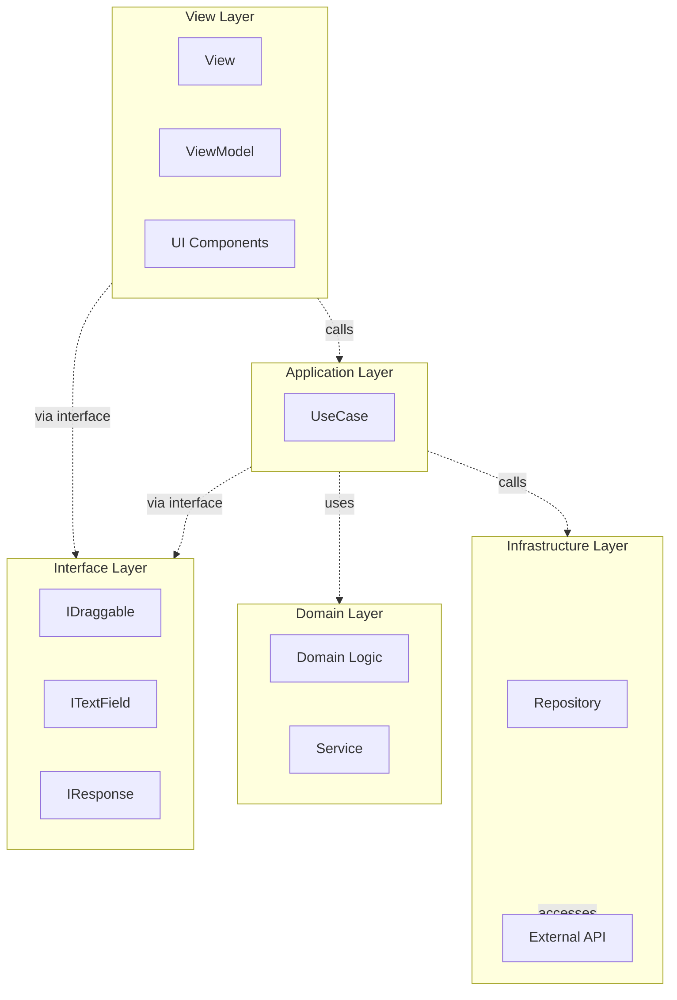

# Next2D Framework

Next2D Framework is an MVVM framework for building applications with Next2D Player. It provides routing for single-page applications (SPA), View/ViewModel management, and configuration management.

## Key Features

- **MVVM Pattern**: Separation of concerns with Model-View-ViewModel
- **Clean Architecture**: Dependency inversion and loosely coupled design
- **Single Page Application**: URL-based scene management
- **Animation Tool Integration**: Seamless integration with Animation Tool assets
- **TypeScript Support**: Type-safe development
- **Atomic Design**: Recommended component design for reusability

## Architecture Overview

This project implements a combination of Clean Architecture and MVVM pattern.



### Layer Responsibilities

| Layer | Path | Role |
|-------|------|------|
| **View** | `view/*`, `ui/*` | Handles screen structure and display |
| **ViewModel** | `view/*` | Bridge between View and Model, event handling |
| **Interface** | `interface/*` | Abstraction layer, type definitions |
| **Application** | `model/application/*/usecase/*` | Business logic implementation (UseCase) |
| **Domain** | `model/domain/*` | Core business rules |
| **Infrastructure** | `model/infrastructure/repository/*` | Data access, external API integration |

### Dependency Direction

Following Clean Architecture principles, dependencies always point inward (toward the Domain layer).

- **View Layer**: Uses Application layer through interfaces
- **Application Layer**: Uses Domain and Infrastructure layers through interfaces
- **Domain Layer**: Depends on nothing (pure business logic)
- **Infrastructure Layer**: Implements Domain layer interfaces

## Directory Structure

```
my-app/
├── src/
│   ├── config/                    # Configuration files
│   │   ├── stage.json             # Stage settings
│   │   ├── config.json            # Environment settings
│   │   ├── routing.json           # Routing settings
│   │   └── Config.ts              # Config type definitions and exports
│   │
│   ├── interface/                 # Interface definitions
│   │   ├── IDraggable.ts          # Draggable object
│   │   ├── ITextField.ts          # Text field
│   │   ├── IHomeTextResponse.ts   # API response type
│   │   └── IViewName.ts           # View name type definition
│   │
│   ├── view/                      # View & ViewModel
│   │   ├── top/
│   │   │   ├── TopView.ts         # Screen structure definition
│   │   │   └── TopViewModel.ts    # Bridge to business logic
│   │   └── home/
│   │       ├── HomeView.ts
│   │       └── HomeViewModel.ts
│   │
│   ├── model/
│   │   ├── application/           # Application layer
│   │   │   ├── top/
│   │   │   │   └── usecase/
│   │   │   │       └── NavigateToViewUseCase.ts
│   │   │   └── home/
│   │   │       └── usecase/
│   │   │           ├── StartDragUseCase.ts
│   │   │           ├── StopDragUseCase.ts
│   │   │           └── CenterTextFieldUseCase.ts
│   │   │
│   │   ├── domain/                # Domain layer
│   │   │   └── callback/
│   │   │       ├── Background.ts
│   │   │       └── Background/
│   │   │           └── service/
│   │   │               ├── BackgroundDrawService.ts
│   │   │               └── BackgroundChangeScaleService.ts
│   │   │
│   │   └── infrastructure/        # Infrastructure layer
│   │       └── repository/
│   │           └── HomeTextRepository.ts
│   │
│   ├── ui/                        # UI Components
│   │   ├── animation/             # Animation definitions
│   │   │   └── top/
│   │   │       └── TopBtnShowAnimation.ts
│   │   │
│   │   ├── component/             # Atomic Design
│   │   │   ├── atom/              # Smallest unit components
│   │   │   │   ├── ButtonAtom.ts
│   │   │   │   └── TextAtom.ts
│   │   │   ├── molecule/          # Combined Atom components
│   │   │   │   ├── HomeBtnMolecule.ts
│   │   │   │   └── TopBtnMolecule.ts
│   │   │   ├── organism/          # Multiple Molecule combinations
│   │   │   ├── template/          # Page templates
│   │   │   └── page/              # Page components
│   │   │       ├── top/
│   │   │       │   └── TopPage.ts
│   │   │       └── home/
│   │   │           └── HomePage.ts
│   │   │
│   │   └── content/               # Animation Tool generated content
│   │       ├── TopContent.ts
│   │       └── HomeContent.ts
│   │
│   ├── assets/                    # Static assets
│   │
│   ├── Packages.ts                # Package exports
│   └── index.ts                   # Entry point
│
├── file/                          # Animation Tool output files
│   └── sample.n2d
│
├── mock/                          # Mock data
│   ├── api/                       # API mocks
│   ├── content/                   # Content mocks
│   └── img/                       # Image mocks
│
└── package.json
```

## Framework Flowchart

Detailed flow of screen transitions using the gotoView function.


### Key Flow Steps

| Step | Description |
|------|-------------|
| **gotoView** | Entry point for screen transitions |
| **Loading** | Loading screen show/hide control |
| **Request Type** | Three types of requests: JSON, CONTENT, CUSTOM |
| **Cache** | Response data cache control |
| **View/ViewModel Bind** | Binding process for new View/ViewModel |
| **onEnter** | Callback after screen display is complete |

## Key Design Patterns

### 1. MVVM (Model-View-ViewModel)

- **View**: Handles screen structure and display. No business logic
- **ViewModel**: Bridge between View and Model. Holds UseCases and processes events
- **Model**: Handles business logic and data access

### 2. UseCase Pattern

Create a dedicated UseCase class for each user action:

```typescript
export class StartDragUseCase
{
    execute(target: IDraggable): void
    {
        target.startDrag();
    }
}
```

### 3. Dependency Inversion

Depend on interfaces, not concrete classes:

```typescript
// Good: Depend on interfaces
import type { IDraggable } from "@/interface/IDraggable";

function startDrag(target: IDraggable): void
{
    target.startDrag();
}
```

### 4. Repository Pattern

Abstract data access and implement error handling:

```typescript
export class HomeTextRepository
{
    static async get(): Promise<IHomeTextResponse>
    {
        try {
            const response = await fetch(`${config.api.endPoint}api/home.json`);
            if (!response.ok) {
                throw new Error(`HTTP error! status: ${response.status}`);
            }
            return await response.json();
        } catch (error) {
            console.error("Failed to fetch:", error);
            throw error;
        }
    }
}
```

## Quick Start

### Create Project

```bash
npx create-next2d-app my-app
cd my-app
npm install
npm start
```

### Auto-generate View/ViewModel

```bash
npm run generate
```

This command parses top properties in `routing.json` and generates corresponding View and ViewModel classes.

## Best Practices

1. **Interface First**: Always depend on interfaces, not concrete types
2. **Single Responsibility Principle**: Each class has only one responsibility
3. **Dependency Injection**: Inject dependencies via constructor
4. **Error Handling**: Handle errors appropriately in Repository layer
5. **Type Safety**: Avoid `any` type, use explicit type definitions

## Related Documentation

### Basics
- [View/ViewModel](/en/reference/framework/view) - Screen display and data binding
- [Routing](/en/reference/framework/routing) - URL-based screen transitions
- [Configuration](/en/reference/framework/config) - Environment and stage settings
- [Animation Tool Integration](/en/reference/framework/animation-tool) - Using Animation Tool assets

### Next2D Player Integration
- [Next2D Player](/en/reference/player) - Rendering engine
- [MovieClip](/en/reference/player/movie-clip) - Timeline animation
- [Event System](/en/reference/player/events) - User interaction
