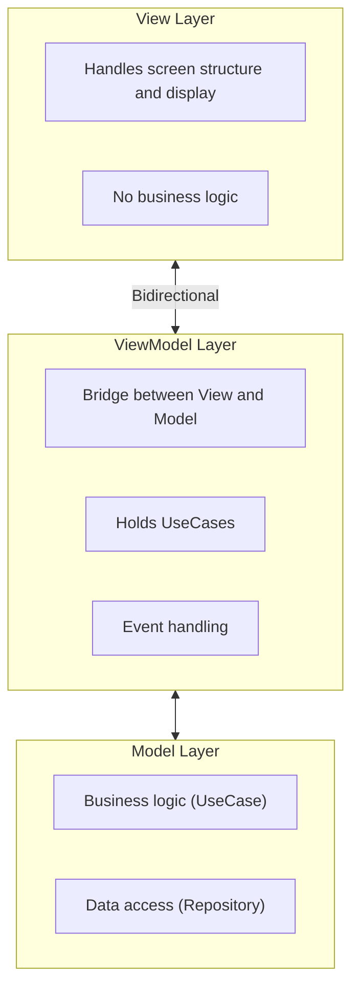
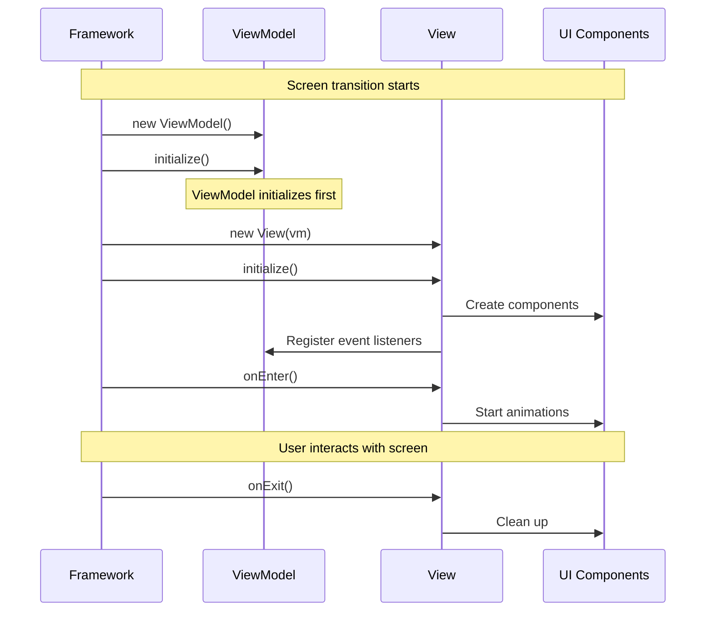

# View and ViewModel

Next2D Framework adopts the MVVM (Model-View-ViewModel) pattern. The basic style is to create one set of View and ViewModel per screen.

## Architecture



## Directory Structure

```
src/
└── view/
    ├── top/
    │   ├── TopView.ts
    │   └── TopViewModel.ts
    └── home/
        ├── HomeView.ts
        └── HomeViewModel.ts
```

## View

View is a container attached to the main context. View handles only the display structure and delegates business logic to the ViewModel.

### View Responsibilities

- **Screen structure definition** - UI component placement and coordinate settings
- **Event listener registration** - Connection with ViewModel methods
- **Lifecycle management** - `initialize`, `onEnter`, `onExit`

### Basic Structure

```typescript
import type { TopViewModel } from "./TopViewModel";
import { View } from "@next2d/framework";
import { TopPage } from "@/ui/component/page/top/TopPage";

export class TopView extends View<TopViewModel>
{
    private readonly _topPage: TopPage;

    constructor(vm: TopViewModel)
    {
        super(vm);
        this._topPage = new TopPage();
        this.addChild(this._topPage);
    }

    async initialize(): Promise<void>
    {
        this._topPage.initialize(this.vm);
    }

    async onEnter(): Promise<void>
    {
        await this._topPage.onEnter();
    }

    async onExit(): Promise<void>
    {
        return void 0;
    }
}
```

### Lifecycle



#### initialize() - Initialization

**When Called:**
- Immediately after View instance is created
- Called only once during screen transition
- Executed **after** ViewModel's `initialize()`

**Primary Usage:**
- Create and arrange UI components
- Register event listeners
- Add child elements (`addChild`)

```typescript
async initialize(): Promise<void>
{
    const { HomeBtnMolecule } = await import("@/ui/component/molecule/HomeBtnMolecule");
    const { PointerEvent } = next2d.events;

    const homeContent = new HomeBtnMolecule();
    homeContent.x = 120;
    homeContent.y = 120;

    // Delegate events to ViewModel
    homeContent.addEventListener(
        PointerEvent.POINTER_DOWN,
        this.vm.homeContentPointerDownEvent
    );

    this.addChild(homeContent);
}
```

#### onEnter() - On Screen Shown

**When Called:**
- After `initialize()` completes
- Just before the screen is displayed

**Primary Usage:**
- Start entrance animations
- Start timers and intervals
- Set focus

```typescript
async onEnter(): Promise<void>
{
    const topBtn = this.getChildByName("topBtn") as TopBtnMolecule;
    topBtn.playEntrance(() => {
        console.log("Animation completed");
    });
}
```

#### onExit() - On Screen Hidden

**When Called:**
- Just before transitioning to another screen
- Before View is destroyed

**Primary Usage:**
- Stop animations
- Clear timers and intervals
- Release resources

```typescript
async onExit(): Promise<void>
{
    if (this.autoSlideTimer) {
        clearInterval(this.autoSlideTimer);
        this.autoSlideTimer = null;
    }
}
```

## ViewModel

ViewModel acts as a bridge between View and Model. It holds UseCases and processes events from View to execute business logic.

### ViewModel Responsibilities

- **Event processing** - Receive events from View
- **UseCase execution** - Call business logic
- **Dependency management** - Hold UseCase instances
- **State management** - Manage screen-specific state

### Basic Structure

```typescript
import { ViewModel, app } from "@next2d/framework";
import { NavigateToViewUseCase } from "@/model/application/top/usecase/NavigateToViewUseCase";

export class TopViewModel extends ViewModel
{
    private readonly navigateToViewUseCase: NavigateToViewUseCase;
    private topText: string = "";

    constructor()
    {
        super();
        this.navigateToViewUseCase = new NavigateToViewUseCase();
    }

    async initialize(): Promise<void>
    {
        // Receive data from routing.json requests
        const response = app.getResponse();
        this.topText = response.has("TopText")
            ? (response.get("TopText") as { word: string }).word
            : "";
    }

    getTopText(): string
    {
        return this.topText;
    }

    async onClickStartButton(): Promise<void>
    {
        await this.navigateToViewUseCase.execute("home");
    }
}
```

### ViewModel Initialization Timing

**Important: ViewModel's `initialize()` is called before View's `initialize()`.**

```
1. ViewModel instance created
   ↓
2. ViewModel.initialize() ← ViewModel first
   ↓
3. View instance created (ViewModel injected)
   ↓
4. View.initialize()
   ↓
5. View.onEnter()
```

This ensures ViewModel data is ready when View initializes.

```typescript
// HomeViewModel.ts
export class HomeViewModel extends ViewModel
{
    private homeText: string = "";

    async initialize(): Promise<void>
    {
        // Fetch data in ViewModel's initialize
        const data = await HomeTextRepository.get();
        this.homeText = data.word;
    }

    getHomeText(): string
    {
        return this.homeText;
    }
}

// HomeView.ts
export class HomeView extends View<HomeViewModel>
{
    constructor(private readonly vm: HomeViewModel)
    {
        super();
    }

    async initialize(): Promise<void>
    {
        // At this point, vm.initialize() is already complete
        const text = this.vm.getHomeText();

        // Build UI using fetched data
        const textField = new TextAtom(text);
        this.addChild(textField);
    }
}
```

## Screen Transition

Use `app.gotoView()` for screen transitions.

```typescript
import { app } from "@next2d/framework";

// Navigate to specified View
await app.gotoView("home");

// Navigate with parameters
await app.gotoView("user/detail?id=123");
```

### Screen Transition in UseCase

```typescript
import { app } from "@next2d/framework";

export class NavigateToViewUseCase
{
    async execute(viewName: string): Promise<void>
    {
        await app.gotoView(viewName);
    }
}
```

## Getting Response Data

Data from `requests` in `routing.json` can be retrieved with `app.getResponse()`.

```typescript
import { app } from "@next2d/framework";

async initialize(): Promise<void>
{
    const response = app.getResponse();

    if (response.has("UserData")) {
        const userData = response.get("UserData");
        this.userName = userData.name;
    }
}
```

## Getting Cache Data

Data with `cache: true` can be retrieved with `app.getCache()`.

```typescript
import { app } from "@next2d/framework";

const cache = app.getCache();
if (cache.has("MasterData")) {
    const masterData = cache.get("MasterData");
}
```

## Design Principles

### 1. Separation of Concerns

```typescript
// Good: View handles display only, ViewModel handles logic
class HomeView extends View<HomeViewModel>
{
    async initialize(): Promise<void>
    {
        const btn = new HomeBtnMolecule();
        btn.addEventListener(PointerEvent.POINTER_DOWN, this.vm.onClick);
    }
}

class HomeViewModel extends ViewModel
{
    onClick(event: PointerEvent): void
    {
        this.someUseCase.execute();
    }
}
```

### 2. Dependency Inversion

ViewModel depends on interfaces, not concrete classes.

```typescript
// Good: Depend on interfaces
homeContentPointerDownEvent(event: PointerEvent): void
{
    const target = event.currentTarget as unknown as IDraggable;
    this.startDragUseCase.execute(target);
}
```

### 3. Always Delegate Events to ViewModel

Never handle events entirely within View; always delegate to ViewModel.

## View/ViewModel Templates

### View

```typescript
import type { YourViewModel } from "./YourViewModel";
import { View } from "@next2d/framework";

export class YourView extends View<YourViewModel>
{
    constructor(vm: YourViewModel)
    {
        super(vm);
    }

    async initialize(): Promise<void>
    {
        // Create and arrange UI components
    }

    async onEnter(): Promise<void>
    {
        // On screen shown
    }

    async onExit(): Promise<void>
    {
        // On screen hidden
    }
}
```

### ViewModel

```typescript
import { ViewModel } from "@next2d/framework";
import { YourUseCase } from "@/model/application/your/usecase/YourUseCase";

export class YourViewModel extends ViewModel
{
    private readonly yourUseCase: YourUseCase;

    constructor()
    {
        super();
        this.yourUseCase = new YourUseCase();
    }

    async initialize(): Promise<void>
    {
        return void 0;
    }

    yourEventHandler(event: Event): void
    {
        this.yourUseCase.execute();
    }
}
```

## Related

- [Routing](/en/reference/framework/routing)
- [Configuration](/en/reference/framework/config)
