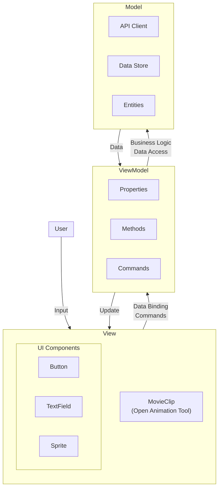
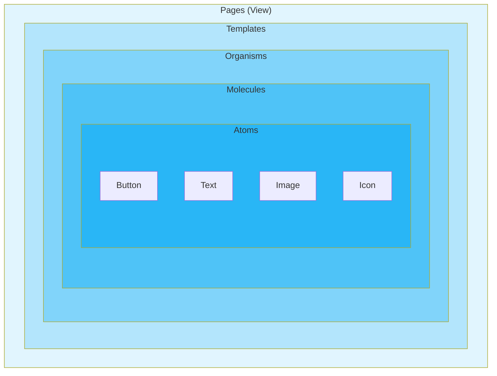

# Next2D Framework

Next2D Frameworkは、Next2D Playerを用いたアプリケーション開発のためのMVVMフレームワークです。シングルページアプリケーション（SPA）のためのルーティング、View/ViewModel管理、環境設定管理などの機能を提供します。

## 主な特徴

- **MVVMパターン**: Model-View-ViewModelパターンによる関心の分離
- **シングルページアプリケーション**: URLベースのシーン管理
- **Open Animation Tool連携**: Open Animation Toolで作成したアセットとの連携
- **TypeScriptサポート**: 型安全な開発が可能
- **アトミックデザイン**: 再利用可能なコンポーネント設計を推奨

## MVVMアーキテクチャ

Next2D FrameworkはMVVM（Model-View-ViewModel）パターンを採用しています。



### 各レイヤーの役割

| レイヤー | 役割 | 担当 |
|----------|------|------|
| **View** | UI表示、ユーザー入力の受付 | デザイナー/アニメーター |
| **ViewModel** | 表示ロジック、状態管理、Viewへのデータ提供 | プログラマー |
| **Model** | ビジネスロジック、データアクセス、API通信 | プログラマー |

### MVVMの利点

1. **関心の分離**: UI（View）とロジック（ViewModel/Model）が分離
2. **テスト容易性**: ViewModelは単体テストが容易
3. **チーム開発**: デザイナーとプログラマーが並行作業可能
4. **再利用性**: ViewModelは異なるViewで再利用可能

## アトミックデザイン

Next2D Frameworkでは、UIコンポーネントの設計にアトミックデザインを推奨しています。



### 各レベルの説明

| レベル | 説明 | 例 |
|--------|------|-----|
| **Atoms** | 最小単位のUI要素 | ボタン、テキストフィールド、アイコン、ラベル |
| **Molecules** | Atomsを組み合わせた機能単位 | 検索フォーム（入力+ボタン）、メニュー項目 |
| **Organisms** | 独立した機能を持つUI領域 | ヘッダー、ナビゲーション、カード一覧 |
| **Templates** | ページのレイアウト構造 | 2カラムレイアウト、ダッシュボードレイアウト |
| **Pages** | 実際のコンテンツを含むページ | トップページ、詳細ページ（= View） |

### Open Animation Toolでの実装

Open Animation Toolでは、シンボルを階層構造で管理することでアトミックデザインを実現：

```
Library
├── atoms/
│   ├── btn_primary.json      # プライマリボタン
│   ├── btn_secondary.json    # セカンダリボタン
│   ├── input_text.json       # テキスト入力
│   └── icon_*.json           # 各種アイコン
├── molecules/
│   ├── search_form.json      # 検索フォーム
│   ├── menu_item.json        # メニュー項目
│   └── card_header.json      # カードヘッダー
├── organisms/
│   ├── header.json           # ヘッダー
│   ├── navigation.json       # ナビゲーション
│   └── card_list.json        # カード一覧
└── templates/
    ├── layout_main.json      # メインレイアウト
    └── layout_detail.json    # 詳細レイアウト
```

## フレームワークフローチャート

gotoView関数による画面遷移の詳細なフローを示します。

```mermaid
graph TD
    User([User]) -->|Request| GotoView[gotoView Path]

    GotoView --> LoadingCheck{use loading?<br/>Default: true}

    LoadingCheck -->|YES| ScreenOverlay[Screen Overlay]
    LoadingCheck -->|NO| RemoveResponse
    ScreenOverlay --> LoadingStart[Start Loading]
    LoadingStart --> RemoveResponse

    RemoveResponse[Remove Previous Response Data] --> ParseQuery[Parse Query String]
    ParseQuery --> UpdateHistory{SPA mode?}

    UpdateHistory -->|YES| PushState[Push History State]
    UpdateHistory -->|NO| RequestType
    PushState --> RequestType

    RequestType[Request Type]

    RequestType --> JSON[JSON: Get external JSON data]
    RequestType --> CONTENT[CONTENT: Get Animation Tool JSON]
    RequestType --> CUSTOM[CUSTOM: Request to external API]

    JSON --> CacheCheck{use cache?<br/>Default: false}
    CONTENT --> CacheCheck
    CUSTOM --> CacheCheck

    CacheCheck -->|YES| CacheData[(Cache)]
    CacheCheck -->|NO| GlobalData{{Global Network}}

    CacheData --> Cached{Cached?}

    Cached -->|NO| GlobalData
    Cached -->|YES| RegisterResponse
    GlobalData --> RegisterResponse

    RegisterResponse[Register Response Data] --> RequestCallback{request callback?}

    RequestCallback -->|YES| ExecRequestCallback[Execute Request Callback]
    RequestCallback -->|NO| UnbindView
    ExecRequestCallback --> UnbindView

    UnbindView[Previous View: onExit & Unbind] --> BindView[New View/ViewModel: Bind]
    BindView --> ViewModelInit[ViewModel: initialize]

    ViewModelInit --> ViewInit[View: initialize]
    ViewInit --> AddToStage[Add View to Stage]
    AddToStage --> GotoViewCallback{gotoView callback?}

    GotoViewCallback -->|YES| ExecGotoViewCallback[Execute gotoView Callback]
    GotoViewCallback -->|NO| LoadingEndCheck
    ExecGotoViewCallback --> LoadingEndCheck

    LoadingEndCheck{use loading?<br/>Default: true}

    LoadingEndCheck -->|YES| LoadingEnd[End Loading]
    LoadingEndCheck -->|NO| OnEnter
    LoadingEnd --> DisposeOverlay[Dispose Screen Overlay]
    DisposeOverlay --> OnEnter

    OnEnter[View: onEnter] --> StartDrawing

    StartDrawing[Start Drawing] -->|Response| User

    style User fill:#d5e8d4,stroke:#82b366
    style StartDrawing fill:#dae8fc,stroke:#6c8ebf
    style CacheData fill:#fff2cc,stroke:#d6b656
    style GlobalData fill:#f5f5f5,stroke:#666666
```



### フローの主要ステップ

| ステップ | 説明 |
|----------|------|
| **gotoView** | 画面遷移のエントリーポイント |
| **Loading** | ローディング画面の表示/非表示制御 |
| **Request Type** | JSON、CONTENT、CUSTOMの3種類のリクエスト |
| **Cache** | レスポンスデータのキャッシュ制御 |
| **View/ViewModel Bind** | 新しいView/ViewModelのバインド処理 |
| **onEnter** | 画面表示完了後のコールバック |

## クイックスタート

### プロジェクトの作成

```bash
npx create-next2d-app my-app
cd my-app
npm install
npm run dev
```

### ディレクトリ構造

```
my-app/
├── src/
│   ├── config/
│   │   └── config.json       # 環境設定
│   ├── view/
│   │   └── TopView.ts        # Viewクラス
│   ├── viewmodel/
│   │   └── TopViewModel.ts   # ViewModelクラス
│   ├── model/
│   │   └── UserModel.ts      # Modelクラス
│   └── index.ts              # エントリーポイント
├── asset/
│   └── content.json          # Open Animation Tool出力
└── package.json
```

## 関連ドキュメント

### 基本
- [View/ViewModel](./view.md) - 画面表示とデータバインディング
- [ルーティング](./routing.md) - URLベースの画面遷移
- [設定ファイル](./config.md) - 環境設定とステージ設定

### Next2D Player連携
- [Next2D Player](../../player/specs/ja/index.md) - レンダリングエンジン
- [MovieClip](../../player/specs/ja/movie-clip.md) - タイムラインアニメーション
- [イベントシステム](../../player/specs/ja/events.md) - ユーザーインタラクション
