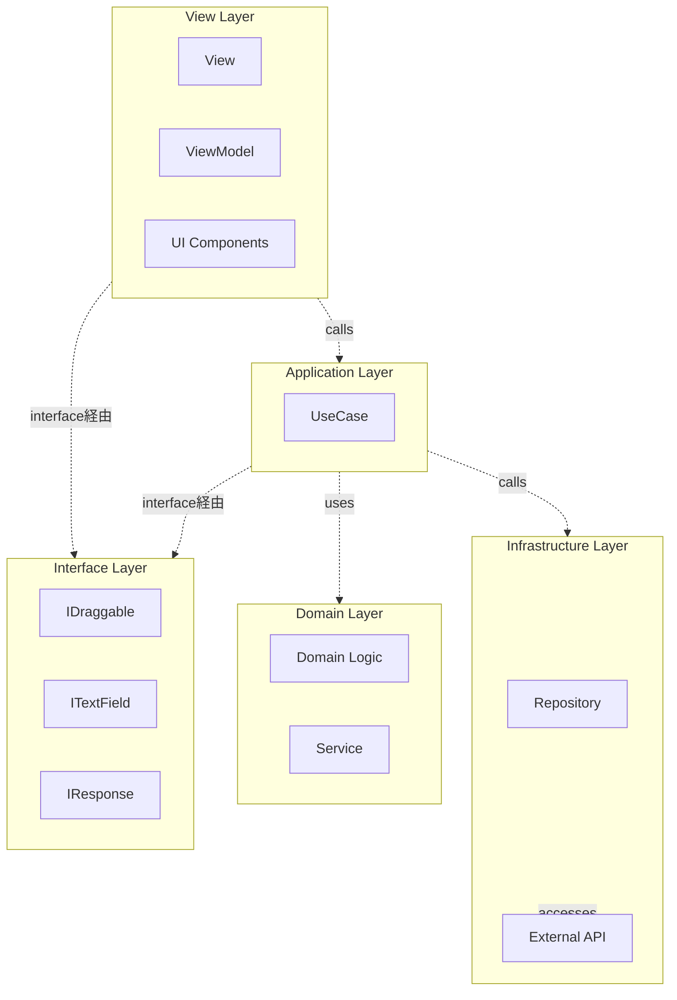

# Next2D Framework

Next2D Frameworkは、Next2D Playerを用いたアプリケーション開発のためのMVVMフレームワークです。シングルページアプリケーション（SPA）のためのルーティング、View/ViewModel管理、環境設定管理などの機能を提供します。

## 主な特徴

- **MVVMパターン**: Model-View-ViewModelパターンによる関心の分離
- **クリーンアーキテクチャ**: 依存性の逆転と疎結合な設計
- **シングルページアプリケーション**: URLベースのシーン管理
- **Animation Tool連携**: Animation Toolで作成したアセットとの連携
- **TypeScriptサポート**: 型安全な開発が可能
- **アトミックデザイン**: 再利用可能なコンポーネント設計を推奨

## アーキテクチャ概要

このプロジェクトはクリーンアーキテクチャとMVVMパターンを組み合わせて実装されています。



### レイヤーの責務

| レイヤー | パス | 役割 |
|----------|------|------|
| **View** | `view/*`, `ui/*` | 画面の構造と表示を担当 |
| **ViewModel** | `view/*` | ViewとModelの橋渡し、イベントハンドリング |
| **Interface** | `interface/*` | 抽象化レイヤー、型定義 |
| **Application** | `model/application/*/usecase/*` | ビジネスロジックの実装（UseCase） |
| **Domain** | `model/domain/*` | コアビジネスルール |
| **Infrastructure** | `model/infrastructure/repository/*` | データアクセス、外部API連携 |

### 依存関係の方向

クリーンアーキテクチャの原則に従い、依存関係は常に内側（Domain層）に向かいます。

- **View層**: インターフェースを通じてApplication層を使用
- **Application層**: インターフェースを通じてDomain層とInfrastructure層を使用
- **Domain層**: 何にも依存しない（純粋なビジネスロジック）
- **Infrastructure層**: Domain層のインターフェースを実装

## ディレクトリ構造

```
my-app/
├── src/
│   ├── config/                    # 設定ファイル
│   │   ├── stage.json             # ステージ設定
│   │   ├── config.json            # 環境設定
│   │   ├── routing.json           # ルーティング設定
│   │   └── Config.ts              # 設定の型定義とエクスポート
│   │
│   ├── interface/                 # インターフェース定義
│   │   ├── IDraggable.ts          # ドラッグ可能なオブジェクト
│   │   ├── ITextField.ts          # テキストフィールド
│   │   ├── IHomeTextResponse.ts   # APIレスポンス型
│   │   └── IViewName.ts           # 画面名の型定義
│   │
│   ├── view/                      # View & ViewModel
│   │   ├── top/
│   │   │   ├── TopView.ts         # 画面の構造定義
│   │   │   └── TopViewModel.ts    # ビジネスロジックとの橋渡し
│   │   └── home/
│   │       ├── HomeView.ts
│   │       └── HomeViewModel.ts
│   │
│   ├── model/
│   │   ├── application/           # アプリケーション層
│   │   │   ├── top/
│   │   │   │   └── usecase/
│   │   │   │       └── NavigateToViewUseCase.ts
│   │   │   └── home/
│   │   │       └── usecase/
│   │   │           ├── StartDragUseCase.ts
│   │   │           ├── StopDragUseCase.ts
│   │   │           └── CenterTextFieldUseCase.ts
│   │   │
│   │   ├── domain/                # ドメイン層
│   │   │   └── callback/
│   │   │       ├── Background.ts
│   │   │       └── Background/
│   │   │           └── service/
│   │   │               ├── BackgroundDrawService.ts
│   │   │               └── BackgroundChangeScaleService.ts
│   │   │
│   │   └── infrastructure/        # インフラ層
│   │       └── repository/
│   │           └── HomeTextRepository.ts
│   │
│   ├── ui/                        # UIコンポーネント
│   │   ├── animation/             # アニメーション定義
│   │   │   └── top/
│   │   │       └── TopBtnShowAnimation.ts
│   │   │
│   │   ├── component/             # アトミックデザイン
│   │   │   ├── atom/              # 最小単位のコンポーネント
│   │   │   │   ├── ButtonAtom.ts
│   │   │   │   └── TextAtom.ts
│   │   │   ├── molecule/          # Atomを組み合わせたコンポーネント
│   │   │   │   ├── HomeBtnMolecule.ts
│   │   │   │   └── TopBtnMolecule.ts
│   │   │   ├── organism/          # 複数Moleculeの組み合わせ
│   │   │   ├── template/          # ページテンプレート
│   │   │   └── page/              # ページコンポーネント
│   │   │       ├── top/
│   │   │       │   └── TopPage.ts
│   │   │       └── home/
│   │   │           └── HomePage.ts
│   │   │
│   │   └── content/               # Animation Tool生成コンテンツ
│   │       ├── TopContent.ts
│   │       └── HomeContent.ts
│   │
│   ├── assets/                    # 静的アセット
│   │
│   ├── Packages.ts                # パッケージエクスポート
│   └── index.ts                   # エントリーポイント
│
├── file/                          # Animation Tool出力ファイル
│   └── sample.n2d
│
├── mock/                          # モックデータ
│   ├── api/                       # APIモック
│   ├── content/                   # コンテンツモック
│   └── img/                       # 画像モック
│
└── package.json
```

## フレームワークフローチャート

gotoView関数による画面遷移の詳細なフローを示します。


### フローの主要ステップ

| ステップ | 説明 |
|----------|------|
| **gotoView** | 画面遷移のエントリーポイント |
| **Loading** | ローディング画面の表示/非表示制御 |
| **Request Type** | JSON、CONTENT、CUSTOMの3種類のリクエスト |
| **Cache** | レスポンスデータのキャッシュ制御 |
| **View/ViewModel Bind** | 新しいView/ViewModelのバインド処理 |
| **onEnter** | 画面表示完了後のコールバック |

## 主要な設計パターン

### 1. MVVM (Model-View-ViewModel)

- **View**: 画面の構造と表示を担当。ビジネスロジックは持たない
- **ViewModel**: ViewとModelの橋渡し。UseCaseを保持し、イベントを処理
- **Model**: ビジネスロジックとデータアクセスを担当

### 2. UseCaseパターン

各ユーザーアクションに対して、専用のUseCaseクラスを作成:

```typescript
export class StartDragUseCase
{
    execute(target: IDraggable): void
    {
        target.startDrag();
    }
}
```

### 3. 依存性の逆転 (Dependency Inversion)

具象クラスではなく、インターフェースに依存:

```typescript
// 良い例: インターフェースに依存
import type { IDraggable } from "@/interface/IDraggable";

function startDrag(target: IDraggable): void
{
    target.startDrag();
}
```

### 4. Repositoryパターン

データアクセスを抽象化し、エラーハンドリングも実装:

```typescript
export class HomeTextRepository
{
    static async get(): Promise<IHomeTextResponse>
    {
        try {
            const response = await fetch(`${config.api.endPoint}api/home.json`);
            if (!response.ok) {
                throw new Error(`HTTP error! status: ${response.status}`);
            }
            return await response.json();
        } catch (error) {
            console.error("Failed to fetch:", error);
            throw error;
        }
    }
}
```

## クイックスタート

### プロジェクトの作成

```bash
npx create-next2d-app my-app
cd my-app
npm install
npm start
```

### View/ViewModelの自動生成

```bash
npm run generate
```

このコマンドは`routing.json`のトッププロパティを解析し、対応するViewとViewModelクラスを生成します。

## ベストプラクティス

1. **インターフェース優先**: 具象型ではなく、常にインターフェースに依存
2. **単一責任の原則**: 各クラスは1つの責務のみを持つ
3. **依存性注入**: コンストラクタで依存を注入
4. **エラーハンドリング**: Repository層で適切にエラーを処理
5. **型安全性**: `any`型を避け、明示的な型定義を使用

## 関連ドキュメント

### 基本
- [View/ViewModel](/ja/reference/framework/view) - 画面表示とデータバインディング
- [ルーティング](/ja/reference/framework/routing) - URLベースの画面遷移
- [設定ファイル](/ja/reference/framework/config) - 環境設定とステージ設定
- [Animation Tool連携](/ja/reference/framework/animation-tool) - Animation Toolアセットの活用

### Next2D Player連携
- [Next2D Player](/ja/reference/player) - レンダリングエンジン
- [MovieClip](/ja/reference/player/movie-clip) - タイムラインアニメーション
- [イベントシステム](/ja/reference/player/events) - ユーザーインタラクション
