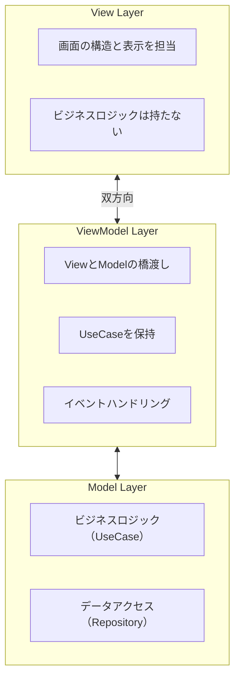
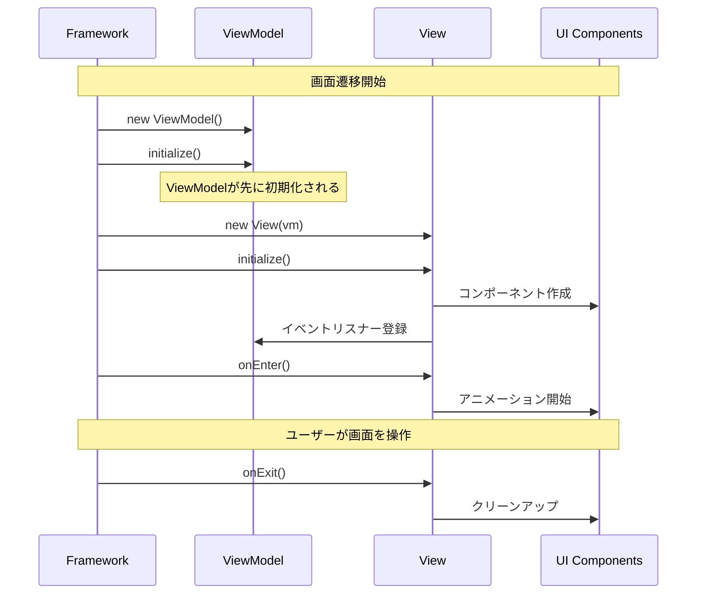

# View と ViewModel

Next2D FrameworkはMVVM（Model-View-ViewModel）パターンを採用しています。1画面にViewとViewModelをワンセット作成するのが基本スタイルです。

## アーキテクチャ



## ディレクトリ構造

```
src/
└── view/
    ├── top/
    │   ├── TopView.ts
    │   └── TopViewModel.ts
    └── home/
        ├── HomeView.ts
        └── HomeViewModel.ts
```

## View

Viewはメインコンテキストにアタッチされるコンテナです。Viewは表示構造のみを担当し、ビジネスロジックはViewModelに委譲します。

### Viewの責務

- **画面の構造定義** - UIコンポーネントの配置と座標設定
- **イベントリスナーの登録** - ViewModelのメソッドと接続
- **ライフサイクル管理** - `initialize`, `onEnter`, `onExit`

### 基本構造

```typescript
import type { TopViewModel } from "./TopViewModel";
import { View } from "@next2d/framework";
import { TopPage } from "@/ui/component/page/top/TopPage";

export class TopView extends View<TopViewModel>
{
    private readonly _topPage: TopPage;

    constructor(vm: TopViewModel)
    {
        super(vm);
        this._topPage = new TopPage();
        this.addChild(this._topPage);
    }

    async initialize(): Promise<void>
    {
        this._topPage.initialize(this.vm);
    }

    async onEnter(): Promise<void>
    {
        await this._topPage.onEnter();
    }

    async onExit(): Promise<void>
    {
        return void 0;
    }
}
```

### ライフサイクル



#### initialize() - 初期化

**呼び出しタイミング:**
- Viewのインスタンスが生成された直後
- 画面遷移時に1回だけ呼び出される
- ViewModelの`initialize()`より**後**に実行される

**主な用途:**
- UIコンポーネントの生成と配置
- イベントリスナーの登録
- 子要素の追加（`addChild`）

```typescript
async initialize(): Promise<void>
{
    const { HomeBtnMolecule } = await import("@/ui/component/molecule/HomeBtnMolecule");
    const { PointerEvent } = next2d.events;

    const homeContent = new HomeBtnMolecule();
    homeContent.x = 120;
    homeContent.y = 120;

    // イベントをViewModelに委譲
    homeContent.addEventListener(
        PointerEvent.POINTER_DOWN,
        this.vm.homeContentPointerDownEvent
    );

    this.addChild(homeContent);
}
```

#### onEnter() - 画面表示時

**呼び出しタイミング:**
- `initialize()`の実行完了後
- 画面が表示される直前

**主な用途:**
- 入場アニメーションの開始
- タイマーやインターバルの開始
- フォーカス設定

```typescript
async onEnter(): Promise<void>
{
    const topBtn = this.getChildByName("topBtn") as TopBtnMolecule;
    topBtn.playEntrance(() => {
        console.log("アニメーション完了");
    });
}
```

#### onExit() - 画面非表示時

**呼び出しタイミング:**
- 別の画面に遷移する直前
- Viewが破棄される前

**主な用途:**
- アニメーションの停止
- タイマーやインターバルのクリア
- リソースの解放

```typescript
async onExit(): Promise<void>
{
    if (this.autoSlideTimer) {
        clearInterval(this.autoSlideTimer);
        this.autoSlideTimer = null;
    }
}
```

## ViewModel

ViewModelはViewとModelの橋渡しを行います。UseCaseを保持し、Viewからのイベントを処理してビジネスロジックを実行します。

### ViewModelの責務

- **イベント処理** - Viewからのイベントを受け取る
- **UseCaseの実行** - ビジネスロジックを呼び出す
- **依存性の管理** - UseCaseのインスタンスを保持
- **状態管理** - 画面固有の状態を管理

### 基本構造

```typescript
import { ViewModel, app } from "@next2d/framework";
import { NavigateToViewUseCase } from "@/model/application/top/usecase/NavigateToViewUseCase";

export class TopViewModel extends ViewModel
{
    private readonly navigateToViewUseCase: NavigateToViewUseCase;
    private topText: string = "";

    constructor()
    {
        super();
        this.navigateToViewUseCase = new NavigateToViewUseCase();
    }

    async initialize(): Promise<void>
    {
        // routing.jsonのrequestsで取得したデータを受け取る
        const response = app.getResponse();
        this.topText = response.has("TopText")
            ? (response.get("TopText") as { word: string }).word
            : "";
    }

    getTopText(): string
    {
        return this.topText;
    }

    async onClickStartButton(): Promise<void>
    {
        await this.navigateToViewUseCase.execute("home");
    }
}
```

### ViewModelの初期化タイミング

**重要: ViewModelの`initialize()`はViewの`initialize()`より前に呼び出されます。**

```
1. ViewModel のインスタンス生成
   ↓
2. ViewModel.initialize() ← ViewModelが先
   ↓
3. View のインスタンス生成（ViewModelを注入）
   ↓
4. View.initialize()
   ↓
5. View.onEnter()
```

これにより、Viewの初期化時にはViewModelのデータが既に準備されています。

```typescript
// HomeViewModel.ts
export class HomeViewModel extends ViewModel
{
    private homeText: string = "";

    async initialize(): Promise<void>
    {
        // ViewModelのinitializeで事前にデータ取得
        const data = await HomeTextRepository.get();
        this.homeText = data.word;
    }

    getHomeText(): string
    {
        return this.homeText;
    }
}

// HomeView.ts
export class HomeView extends View<HomeViewModel>
{
    constructor(private readonly vm: HomeViewModel)
    {
        super();
    }

    async initialize(): Promise<void>
    {
        // この時点でvm.initialize()は既に完了している
        const text = this.vm.getHomeText();

        // 取得済みのデータを使ってUIを構築
        const textField = new TextAtom(text);
        this.addChild(textField);
    }
}
```

## 画面遷移

画面遷移には`app.gotoView()`を使用します。

```typescript
import { app } from "@next2d/framework";

// 指定のViewに遷移
await app.gotoView("home");

// パラメータ付きで遷移
await app.gotoView("user/detail?id=123");
```

### UseCaseでの画面遷移

```typescript
import { app } from "@next2d/framework";

export class NavigateToViewUseCase
{
    async execute(viewName: string): Promise<void>
    {
        await app.gotoView(viewName);
    }
}
```

## レスポンスデータの取得

`routing.json`で設定した`requests`のデータは`app.getResponse()`で取得できます。

```typescript
import { app } from "@next2d/framework";

async initialize(): Promise<void>
{
    const response = app.getResponse();

    if (response.has("UserData")) {
        const userData = response.get("UserData");
        this.userName = userData.name;
    }
}
```

## キャッシュデータの取得

`cache: true`を設定したデータは`app.getCache()`で取得できます。

```typescript
import { app } from "@next2d/framework";

const cache = app.getCache();
if (cache.has("MasterData")) {
    const masterData = cache.get("MasterData");
}
```

## 設計原則

### 1. 関心の分離

```typescript
// 良い例: Viewは表示のみ、ViewModelはロジック
class HomeView extends View<HomeViewModel>
{
    async initialize(): Promise<void>
    {
        const btn = new HomeBtnMolecule();
        btn.addEventListener(PointerEvent.POINTER_DOWN, this.vm.onClick);
    }
}

class HomeViewModel extends ViewModel
{
    onClick(event: PointerEvent): void
    {
        this.someUseCase.execute();
    }
}
```

### 2. 依存性の逆転

ViewModelはインターフェースに依存し、具象クラスに依存しません。

```typescript
// 良い例: インターフェースに依存
homeContentPointerDownEvent(event: PointerEvent): void
{
    const target = event.currentTarget as unknown as IDraggable;
    this.startDragUseCase.execute(target);
}
```

### 3. イベントは必ずViewModelに委譲

View内でイベント処理を完結させず、必ずViewModelに委譲します。

## View/ViewModel作成のテンプレート

### View

```typescript
import type { YourViewModel } from "./YourViewModel";
import { View } from "@next2d/framework";

export class YourView extends View<YourViewModel>
{
    constructor(vm: YourViewModel)
    {
        super(vm);
    }

    async initialize(): Promise<void>
    {
        // UIコンポーネントの作成と配置
    }

    async onEnter(): Promise<void>
    {
        // 画面表示時の処理
    }

    async onExit(): Promise<void>
    {
        // 画面非表示時の処理
    }
}
```

### ViewModel

```typescript
import { ViewModel } from "@next2d/framework";
import { YourUseCase } from "@/model/application/your/usecase/YourUseCase";

export class YourViewModel extends ViewModel
{
    private readonly yourUseCase: YourUseCase;

    constructor()
    {
        super();
        this.yourUseCase = new YourUseCase();
    }

    async initialize(): Promise<void>
    {
        return void 0;
    }

    yourEventHandler(event: Event): void
    {
        this.yourUseCase.execute();
    }
}
```

## 関連項目

- [ルーティング](/ja/reference/framework/routing)
- [設定ファイル](/ja/reference/framework/config)
